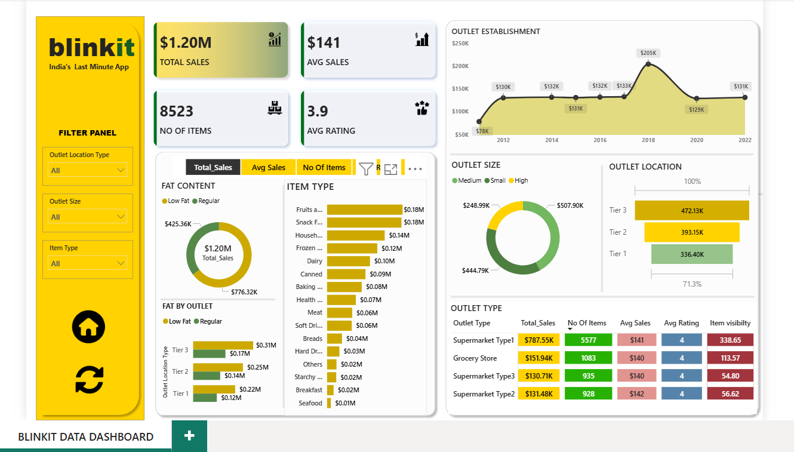

# Blinkit Dashboard Project

## Project Overview
The Blinkit Dashboard is a **data analysis and visualization project** aimed at analyzing Blinkit’s sales and delivery data. The dashboard provides actionable insights to optimize business performance, track trends, and monitor key metrics.  

## Objective
- Analyze sales data across products, cities, and outlets.  
- Track total sales, average sales, ratings, and outlet performance.  
- Monitor product quantity (MO of Items) and category trends.  
- Enable data-driven decisions for operations, marketing, and supply chain.  

## Tools Used
- **Power BI** – for interactive dashboards and visualizations  
- **Excel / CSV** – for raw data input and preparation  
- **DAX** – for calculated columns and measures  
- **Data Cleaning Tools** – for transforming and organizing data  

## Key Metrics & Features
- **Total Sales:** Total revenue generated by products and outlets.  
- **Average Sales:** Average sales per product or outlet.  
- **Average Rating:** Customer ratings for products or outlets.  
- **Outlet Size Analysis:** Insights based on outlet size and performance.  
- **MO of Items:** Number of items sold across products and categories.  
- **Sales Trends:** Visualize total sales over time and identify peak periods.  
- **Product & City-wise Analysis:** Track top-selling products and city performance.  
- **Interactive Filters:** Filter data by product, city, outlet size, or date for deeper insights.  

## Screenshots
### Dashboard Overview

## Data Sources
- Blinkit sales dataset containing:  
  - Product Name  
  - Quantity Sold  
  - Revenue  
  - Average Rating  
  - City / Market  
  - Outlet Size  
  - Number of Items (MO of Items)  
  - Date of Sale  

## Visuals Used
- Column Charts, Bar Charts, Line Charts for trends  
- Pie / Donut Charts for product/category share  
- KPIs and Cards for key metrics  
- Maps for city-wise insights  
- Interactive slicers for filtering by product, city, outlet size, or date  

## How to Use
1. Open the dashboard in **Power BI Desktop**.  
2. Use the slicer
